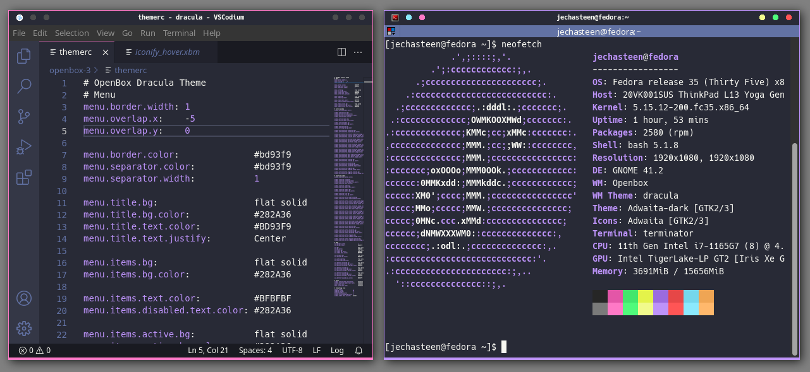

# Dracula for [Openbox](https://openbox.org)

> A dark theme for [Openbox](https://openbox.org).

## [Install](INSTALL.md)

Follow these [instructions](INSTALL.md)

## Team

This theme is maintained by the following person(s) and a bunch of [awesome contributors](https://github.com/jechasteen/dracula-openbox/graphs/contributors).

 |
--- |
[Jonathan Chasteen](https://github.com/jechasteen) |

## Acknowledgments

This theme was created using [fikriomar16's obtgen script](https://github.com/fikriomar16/obtgen) as a starting point.

## License

[MIT License](./LICENSE)